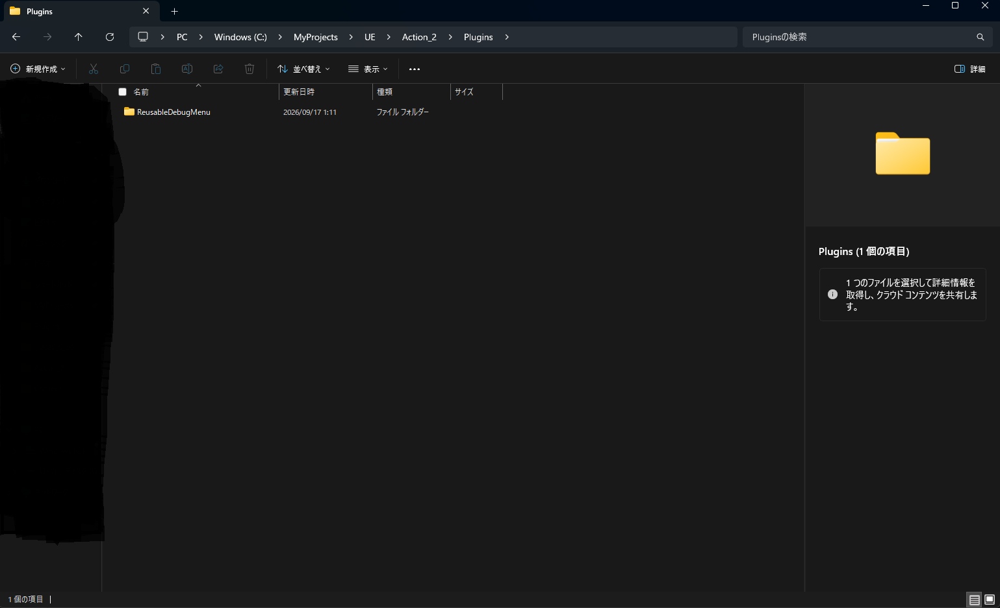
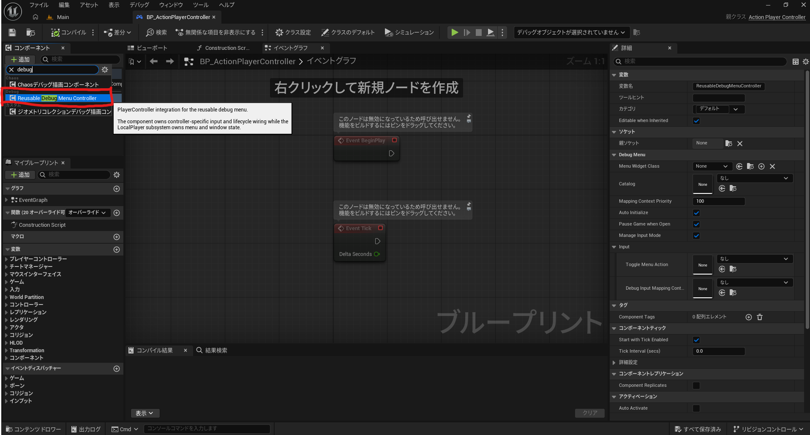
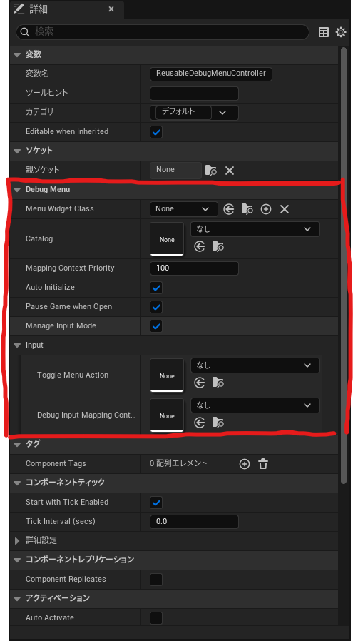
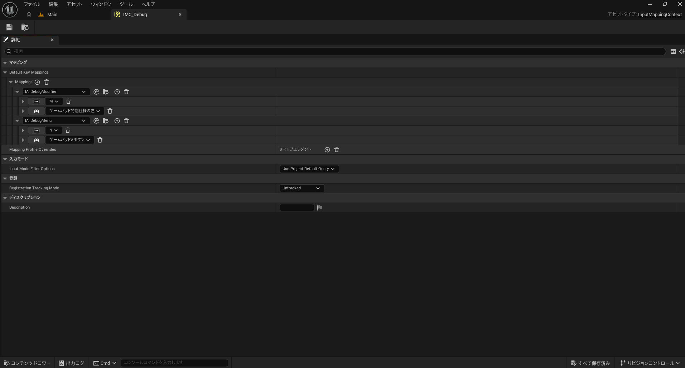
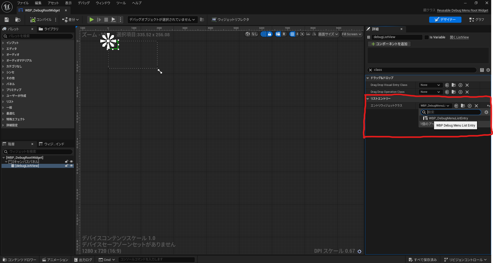
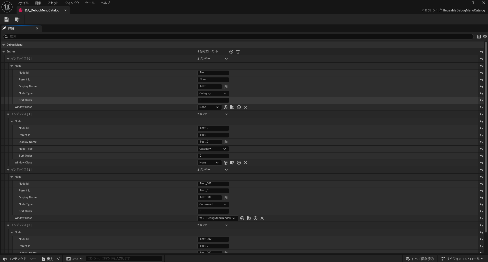
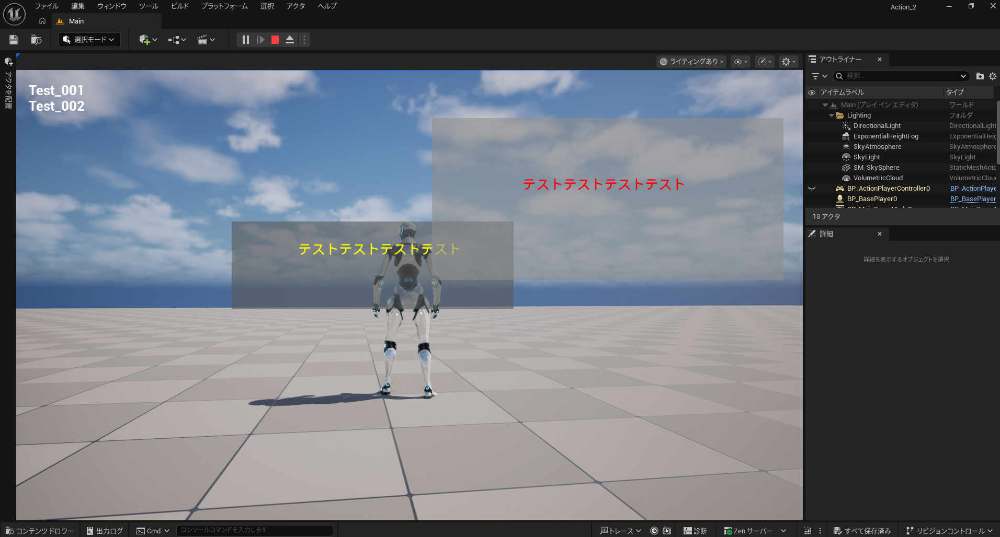

# ReusableDebugMenu

Unreal Engine用の、再利用可能なデータ駆動型デバッグメニュープラグインです。

このREADMEは、プラグインを別のUnreal Engineプロジェクトへ追加し、Blueprint中心でデバッグメニューを表示するところまでを完結できるようにまとめています。

## 目次

- [最短セットアップ](#0-最短セットアップ)
- [提供する機能](#1-提供する機能)
- [動作要件](#2-動作要件)
- [プラグインをプロジェクトへ追加する](#3-プラグインをプロジェクトへ追加する)
- [Enhanced Inputの前提設定](#4-enhanced-inputの前提設定)
- [推奨する統合方法](#5-推奨する統合方法)
- [プロジェクト独自のアセットを作成する](#6-プロジェクト独自のアセットを作成する)
- [Componentへアセットを設定する](#7-componentへアセットを設定する)
- [PIEで確認する](#8-pieで確認する)
- [Runtimeの挙動](#9-runtimeの挙動)
- [C++から利用する場合](#10-cから利用する場合)
- [既存プロジェクトへ導入するときの責務分担](#11-既存プロジェクトへ導入するときの責務分担)
- [トラブルシューティング](#12-トラブルシューティング)
- [Automation Test](#13-automation-test)
- [サンプルアセットの場所](#14-サンプルアセットの場所)

## 0. 最短セットアップ

既存のサンプルアセットを使う場合は、次の手順だけで動作確認できます。

1. この ReusableDebugMenu フォルダを対象プロジェクトの Plugins フォルダへコピーする。
2. Unreal Editorを終了した状態で、プロジェクトを一度ビルドする。
3. Editorを起動し、ReusableDebugMenuプラグインを有効にする。
4. 既存の PlayerController Blueprintを開く。
5. Add Component から ReusableDebugMenuControllerComponent を追加する。
6. 次のサンプルアセットをComponentのプロパティへ設定する。

| Componentのプロパティ | サンプルアセット |
| --- | --- |
| ToggleMenuAction | Plugins/ReusableDebugMenu/Content/Input/Actions/IA_DebugMenu.uasset |
| DebugInputMappingContext | Plugins/ReusableDebugMenu/Content/Input/InputMappingContext/IMC_Debug.uasset |
| MenuWidgetClass | Plugins/ReusableDebugMenu/Content/Widgets/WBP_DebugRootWidget.uasset |
| Catalog | Plugins/ReusableDebugMenu/Content/DataAssets/DA_DebugMenuCatalog.uasset |

7. GameModeの PlayerController Class に、そのPlayerController Blueprintを設定する。
8. PIEを開始し、IMC_Debugに設定されているToggleキーを入力する。

この手順で表示されない場合は、[トラブルシューティング](#トラブルシューティング)を確認してください。

サンプルアセットを使わず、プロジェクト独自のUIやメニューを作る場合は、[プロジェクト独自のアセットを作成する](#プロジェクト独自のアセットを作成する)へ進んでください。

## 1. 提供する機能

- UReusableDebugMenuControllerComponentによるPlayerControllerとの統合
- Enhanced InputによるToggle入力
- Local Player単位のメニュー管理
- Category / Commandによる階層メニュー
- UReusableDebugMenuCatalog Data Assetによるメニュー定義
- UReusableDebugMenuWindow派生WidgetによるCommand画面
- Menu本体とDebug Windowの独立表示
- Pause状態、Cursor状態、Input Modeの復元
- 複数Local Playerへの対応
- ShippingビルドでのRuntime生成無効化
- Registryの不正なツリー構造を検証するAutomation Test

## 2. 動作要件

- Unreal Engine 5.7で確認済み
- Enhanced Inputプラグイン
- UMG
- C++プロジェクト、またはC++プラグインをビルドできる環境

このプラグインは ReusableDebugMenu.uplugin でEnhanced Inputを依存プラグインとして宣言しています。

プラグインの主要なRuntime依存モジュールは次のとおりです。

- Core
- CoreUObject
- Engine
- EnhancedInput
- SlateCore
- UMG

ホストプロジェクトのC++からプラグインの公開クラスをincludeする場合は、対象モジュールの Build.cs に ReusableDebugMenu を追加してください。

~~~csharp
PublicDependencyModuleNames.AddRange(new[]
{
    "Core",
    "CoreUObject",
    "Engine",
    "EnhancedInput",
    "ReusableDebugMenu",
    "UMG"
});
~~~

## 3. プラグインをプロジェクトへ追加する

### 3.1 フォルダをコピーする

プロジェクトのフォルダ構成が次のようになるようにコピーします。

~~~text
YourProject/
├─ YourProject.uproject
└─ Plugins/
   └─ ReusableDebugMenu/
      ├─ Content/
      ├─ Docs/
      │  └─ Images/
      ├─ Source/
      ├─ README.md
      └─ ReusableDebugMenu.uplugin
~~~

Sourceだけでなく、サンプルアセットを含む Content も必要です。

*図1. Plugins/ReusableDebugMenu の配置場所*

### 3.2 プラグインを有効化する

Editorを起動し、Edit > Plugins から ReusableDebugMenu を有効化します。

または、プロジェクトの .uproject に次を追加できます。

~~~json
{
    "Name": "ReusableDebugMenu",
    "Enabled": true
}
~~~

すでに Plugins 配列がある場合は、その配列内へ追加してください。

### 3.3 C++モジュールをビルドする

次の手順を推奨します。

1. Unreal Editorを終了する。
2. .uproject を右クリックし、IDE用のProject Filesを再生成する。
3. Editorターゲットをビルドする。
4. Editorを再起動する。

Live CodingやHot ReloadでReflection型を変更した場合、既存のData Assetを保存する前に型不一致警告がないことを確認してください。

## 4. Enhanced Inputの前提設定

このプラグインは UEnhancedInputComponent と UEnhancedPlayerInput を使用します。

プロジェクトの Config/DefaultInput.ini に次の設定がない場合は追加してください。

~~~ini
[/Script/Engine.InputSettings]
DefaultPlayerInputClass=/Script/EnhancedInput.EnhancedPlayerInput
DefaultInputComponentClass=/Script/EnhancedInput.EnhancedInputComponent
~~~

設定後はEditorを再起動してください。

DefaultInputComponentClass が通常の UInputComponent のままだと、ComponentがToggle Actionを登録できず、Output Logに次の警告が出ます。

~~~text
Debug menu input binding is unavailable on [component].
~~~

## 5. 推奨する統合方法

通常は、PlayerController Blueprintへ ReusableDebugMenuControllerComponent を追加して使用します。

この方法では、ホストプロジェクト側でSubsystemの生成やWidgetの生成コードを書く必要がありません。

~~~mermaid
flowchart TD
    PC[PlayerController Blueprint]
    Component[ReusableDebugMenuControllerComponent]
    Input[Enhanced Input]
    Subsystem[ReusableDebugMenuSubsystem]
    Registry[ReusableDebugMenuRegistry]
    Root[Root Widget]
    Window[Debug Window]
    Catalog[Catalog Data Asset]

    PC --> Component
    Component --> Input
    Component --> Subsystem
    Catalog --> Registry
    Subsystem --> Registry
    Subsystem --> Root
    Subsystem --> Window
    Root --> Registry
~~~

### 5.1 PlayerControllerへComponentを追加する

1. 使用するPlayerController Blueprintを開く。
2. Add Componentを選択する。
3. ReusableDebugMenuControllerComponentを追加する。
4. Componentを選択し、次のプロパティを設定する。

*図2. PlayerController BlueprintへのComponent追加*

| プロパティ | 必須 | 説明 |
| --- | --- | --- |
| ToggleMenuAction | 必須 | メニューを開閉するInput Action |
| DebugInputMappingContext | 必須 | Local Playerへ登録するMapping Context |
| MenuWidgetClass | 必須 | UReusableDebugMenuRootWidget派生の具象Widget |
| Catalog | 推奨 | MenuのCategory / Command定義 |
| MappingContextPriority | 推奨 | Debug用Mapping Contextの優先度。初期値は100 |
| bAutoInitialize | 推奨 | BeginPlayで自動初期化する。初期値はtrue |
| bPauseGameWhenOpen | 任意 | Menu表示中にPauseする。初期値はtrue |
| bManageInputMode | 任意 | Menu表示時にInput ModeとCursorを変更する。初期値はtrue |

*図3. Componentへ4つのアセットを設定した状態*

ComponentのOwnerは APlayerController でなければなりません。

PawnやCharacterへ追加した場合、次の警告が出て動作しません。

~~~text
ReusableDebugMenuControllerComponent must be owned by a PlayerController.
~~~

### 5.2 GameModeへPlayerControllerを設定する

Componentを追加したPlayerController Blueprintが、実際のGameModeで使用されている必要があります。

確認方法：

1. 使用中のGameMode Blueprintを開く。
2. Player Controller Class にPlayerController Blueprintを設定する。
3. World Settingsで別のGameModeが指定されていないか確認する。
4. PIEを開始する。

## 6. プロジェクト独自のアセットを作成する

サンプルアセットをそのまま使うのではなく、プロジェクトの見た目や用途に合わせる場合は、次の4種類を作成します。

1. Input Action
2. Input Mapping Context
3. Root WidgetとList Entry Widget
4. CatalogとCommand Window

### 6.1 Toggle用Input Actionを作成する

Content Browserで Input Actionを作成します。

例：

~~~text
Content/Debug/Input/IA_DebugMenu
~~~

このActionを、PlayerController Componentの ToggleMenuAction に設定します。

Toggle入力は Started イベントで処理されます。長押し中に毎フレーム開閉しないよう、Toggle用途では Triggered ではなく Started を使用してください。

ゲームをPauseしている間もToggleしたい場合は、ActionとChordに使用するActionの Trigger When Paused を有効にしてください。

### 6.2 Input Mapping Contextを作成する

Input Mapping Contextを作成し、Toggle用Input Actionを割り当てます。

例：

~~~text
Content/Debug/Input/IMC_Debug
~~~

このContextをComponentの DebugInputMappingContext に設定します。

このMapping ContextはPawnではなくLocal Playerへ登録されます。そのため、Pawnが未生成、死亡、UnPossessedの状態でもToggle入力を受け取れます。

デバッグ用Actionを通常のPawn用Mapping Contextにも登録すると、Pawnの所有中に入力が重複する場合があります。Toggle用ActionはDebug用Contextにだけ登録してください。

*図4. Debug用Input Mapping Contextの設定*

### 6.3 Root Widgetを作成する

User Widget Blueprintを作成し、親クラスに UReusableDebugMenuRootWidget を指定します。

Root Widgetには、次の名前のListViewが必須です。

~~~text
debugListView
~~~

Widget階層の例：

~~~text
WBP_MyDebugRoot
└─ CanvasPanel
   └─ Border
      └─ ListView
         Name: debugListView
~~~

debugListView の Entry Widget Class には、次のList Entry Widgetを指定します。

*図5. Root Widgetの階層、debugListView、Entry Widget Classの設定*

Root Widgetは、RegistryのMenu項目を表示し、Categoryの移動とCommand選択を処理します。

Root Widget Blueprint側で InitializeMenu を呼び出す必要はありません。ComponentモードではSubsystemが自動的に初期化します。

### 6.4 List Entry Widgetを作成する

User Widget Blueprintを作成し、親クラスに UReusableDebugMenuListEntryWidget を指定します。

次のWidget名が必要です。

| Widget名 | 種類 | 必須 |
| --- | --- | --- |
| entryTitleText | TextBlock | 必須 |
| selectorText | TextBlock | 任意 |
| entryButton | Button | 任意 |

entryTitleText はMenuのDisplayNameを表示します。

selectorText は選択状態の表示に使用できます。存在しない場合でも動作します。

### 6.5 Catalog Data Assetを作成する

Content Browserで Miscellaneous > Data Asset を選択し、クラスに ReusableDebugMenuCatalog を指定します。

例：

~~~text
Content/Debug/DataAssets/DA_MyDebugMenuCatalog
~~~

Catalogの Entries にMenu項目を追加します。

#### Categoryの例

| 項目 | 値 |
| --- | --- |
| NodeId | Project.Player |
| ParentId | 空 |
| DisplayName | Player |
| NodeType | Category |
| SortOrder | 0 |
| WindowClass | 空 |

#### Commandの例

| 項目 | 値 |
| --- | --- |
| NodeId | Project.Player.Health |
| ParentId | Project.Player |
| DisplayName | Health |
| NodeType | Command |
| SortOrder | 0 |
| WindowClass | 具象Window Blueprint |

Catalogには次のルールがあります。

- NodeId はCatalog内で一意にする
- NodeId は保存済みデータやコードから参照する安定した識別子にする
- DisplayName は空にしない
- ParentId は空、または既存Categoryの NodeId にする
- Categoryには子Nodeを追加できる
- Commandを親にはできない
- Categoryに WindowClass を設定しない
- Commandには具象の UReusableDebugMenuWindow 派生クラスを設定する
- 循環した親子関係を作らない

*図6. CatalogのCategory / Command定義*

不正なEntryが1つでもある場合、Catalog全体がRegistryへ登録されません。

### 6.6 Command Windowを作成する

User Widget Blueprintを作成し、親クラスに UReusableDebugMenuWindow を指定します。

Windowの見た目や、対象システムの情報取得はプロジェクト側で実装します。

画面を閉じるButtonでは、Windowを直接Removeするのではなく、Blueprintから RequestClose を呼び出してください。

~~~text
Button OnClicked
└─ RequestClose
~~~

WindowのライフサイクルはSubsystemが管理します。

- 表示開始時: On Debug Window Opened
- 表示終了時: On Debug Window Closed
- 閉じる要求: RequestClose

Window Blueprint側で別のDebug Windowを生成・管理する必要はありません。

## 7. Componentへアセットを設定する

作成したアセットをPlayerController Blueprintの ReusableDebugMenuControllerComponent へ設定します。

| プロパティ | 設定例 |
| --- | --- |
| ToggleMenuAction | IA_MyDebugMenu |
| DebugInputMappingContext | IMC_MyDebug |
| MenuWidgetClass | WBP_MyDebugRoot |
| Catalog | DA_MyDebugMenuCatalog |
| MappingContextPriority | 100 |
| bAutoInitialize | true |
| bPauseGameWhenOpen | true |
| bManageInputMode | true |

## 8. PIEで確認する

次の順番で確認してください。

1. PIEを開始する。
2. Toggleキーを押してRoot Menuが表示されることを確認する。
3. Categoryを選択して子項目へ移動する。
4. EnterまたはGamepadの決定ボタンでCommandを選択する。
5. Command Windowが表示されることを確認する。
6. MenuをToggleで閉じてもWindowが残ることを確認する。
7. Menuを閉じたとき、PauseとInput Modeが復元されることを確認する。
8. Menuを再表示し、WindowのClose Buttonから RequestClose を呼ぶ。
9. Pawn生成前、UnPossessed後、Pawn消滅後にもToggleできることを確認する。
10. キーボードとゲームパッドの両方を確認する。

*図7. PIEでRoot MenuとCommand Windowを確認している状態*

Root Menuの操作は次のとおりです。

| 操作 | 動作 |
| --- | --- |
| Toggle Action | Menuの表示 / 非表示 |
| Enter | 選択項目の決定 |
| Gamepad Face Button Bottom | 選択項目の決定 |
| Escape | Categoryを1階層戻る |
| BackSpace | Categoryを1階層戻る |
| Gamepad Face Button Right | Categoryを1階層戻る |

最上位Categoryで戻る操作をしても、Root Menuは閉じません。Root Menuを閉じる場合はToggle Actionを使用してください。

## 9. Runtimeの挙動

### Local Player単位

Subsystemは ULocalPlayerSubsystem です。

Player Index 0を前提にせず、Local Playerごとに次の状態が独立します。

- Root Menu
- Debug Window
- Registry
- Input Context
- Pause / Input Mode復元状態

### MenuとWindowの独立性

Commandを決定すると、Debug WindowはRoot Menuとは別のWidgetとして表示されます。

Root Menuを閉じても、表示中のWindowは残ります。Root Menuを閉じた時点で、通常はInput ModeがGame Onlyへ戻り、Subsystem自身がPauseしていた場合はPauseも解除されます。

Windowを操作または終了する場合は、Root Menuを再表示してください。

### PauseとInput Mode

bPauseGameWhenOpen が有効な場合、SubsystemはMenu表示時にPauseを試みます。

Subsystem自身がPauseに成功した場合だけ、Menuを閉じるとPauseを解除します。

bManageInputMode が有効な場合は、Menu表示時に次を適用します。

- FInputModeGameAndUI
- Mouse Cursor表示
- Root WidgetへのFocus

Menuを閉じると、通常は次を適用します。

- FInputModeGameOnly
- Menu表示前のCursor状態

既存のInput Mode Stackをプロジェクト側で管理している場合は、bManageInputModeをfalseにし、ホスト側でInput Modeを管理してください。

### Shippingビルド

ShippingビルドではSubsystemを生成しません。

そのため、Shippingビルドでデバッグメニューが表示されないのは意図した挙動です。

## 10. C++から利用する場合

通常はController Componentの利用を推奨します。

Data Assetを使わず、C++からMenu Nodeを動的に登録することもできます。

~~~cpp
#include "DebugMenuSubsystem.h"
#include "DebugMenuTypes.h"
#include "Engine/LocalPlayer.h"

void AMyPlayerController::BeginPlay()
{
    Super::BeginPlay();

    ULocalPlayer* LocalPlayer = GetLocalPlayer();
    if (!IsValid(LocalPlayer))
    {
        return;
    }

    UReusableDebugMenuSubsystem* Subsystem =
        LocalPlayer->GetSubsystem<UReusableDebugMenuSubsystem>();
    if (!IsValid(Subsystem))
    {
        return;
    }

    Subsystem->Configure(RootWidgetClass, nullptr, true, true);

    FText Error;
    if (!Subsystem->RegisterNodes(CategoryNodes, Error))
    {
        UE_LOG(LogTemp, Error, TEXT("Failed to register categories: %s"), *Error.ToString());
        return;
    }

    if (!Subsystem->RegisterWindowNode(CommandNode, WindowClass, Error))
    {
        UE_LOG(LogTemp, Error, TEXT("Failed to register command: %s"), *Error.ToString());
    }
}
~~~

この方式では、次の処理をホスト側で実装する必要があります。

- Enhanced Input Mapping Contextの登録
- Toggle ActionのInput Binding
- 必要に応じたChord判定
- Root Widget Classの提供
- Window Classの提供

入力処理まで含めて利用する場合は、ReusableDebugMenuControllerComponentを使う方が安全です。

## 11. 既存プロジェクトへ導入するときの責務分担

プラグイン本体とホストプロジェクトの責務は次のように分かれています。

| 内容 | 所有者 |
| --- | --- |
| Menuの表示・非表示 | ReusableDebugMenu |
| Windowの生成・終了 | ReusableDebugMenu |
| Nodeのツリー検証 | ReusableDebugMenu |
| Local Player単位の状態管理 | ReusableDebugMenu |
| Menu階層とDisplayName | ホスト側Catalog |
| Windowの見た目と情報取得 | ホスト側Window Blueprint |
| Root Widgetのレイアウト | ホスト側Root Widget Blueprint |
| Toggleキー | ホスト側Input Action / Mapping Context |
| PlayerControllerとの接続 | Componentまたはホスト側Adapter |

通常のMenu項目追加では、プラグイン本体のC++を変更する必要はありません。

## 12. トラブルシューティング

### Plugin moduleが見つからない

次を確認してください。

- Plugins/ReusableDebugMenu/ReusableDebugMenu.uplugin が存在する
- Sourceフォルダをコピーしている
- Unreal Editorを終了してからビルドした
- Project Filesを再生成した
- C++プロジェクトの Build.cs に ReusableDebugMenu がある

### Toggleキーが反応しない

次を順番に確認してください。

1. GameModeの PlayerController Class が正しいか
2. ComponentのOwnerがPlayerControllerか
3. ToggleMenuAction が設定されているか
4. DebugInputMappingContext が設定されているか
5. Mapping ContextにToggle Actionのキーが登録されているか
6. DefaultInputComponentClass が EnhancedInputComponent か
7. bAutoInitialize がtrueか
8. Output Logに Debug menu input binding is unavailable が出ていないか
9. 同じToggle Actionを別のMapping Contextへ重複登録していないか

現在のController Componentは、BeginPlay時または InitializeDebugMenu() 呼び出し時に入力を初期化します。初回にEnhanced Inputの準備ができていない場合は、後から InitializeDebugMenu() を呼び出して再試行してください。

### Menuは表示されるが項目がない

次を確認してください。

- Catalogが設定されている
- Catalogの Entries が空ではない
- NodeIdが空ではない
- DisplayNameが空ではない
- ParentIdが存在するCategoryを指している
- Commandの WindowClass が具象クラスである
- Categoryに WindowClass を設定していない
- Output LogにCatalog登録エラーが出ていない

### ゲームだけPauseされてMenuが見えない

Catalogが不正で全Entryの登録に失敗している可能性があります。

Output Logで次のようなエラーを確認してください。

~~~text
Rejected debug menu catalog [catalog]
Cannot open debug menu: MenuWidgetClass is missing or abstract.
~~~

また、Root Widget Blueprintに debugListView が存在し、ListViewのEntry Widget Classが設定されていることを確認してください。

### Windowが閉じない

WindowのClose Buttonから Remove From Parent を直接呼ばず、RequestCloseを呼んでください。

Windowを閉じた後の後処理は On Debug Window Closed に実装します。

### Menuを閉じてもWindowが残る

これは正常な挙動です。

Root MenuとDebug Windowは独立しています。Windowを閉じる場合はRoot Menuを再表示し、Window内のClose Buttonから RequestClose を呼び出してください。

### Shippingビルドで表示されない

ShippingビルドではRuntime生成が無効化されています。開発用ビルドやEditorで確認してください。

## 13. Automation Test

Registryのツリー検証テストが含まれています。

テスト対象：

- 親が存在しないNode
- 自分自身を親にするNode
- 複数Nodeによる循環参照
- 同一バッチ内の重複 NodeId
- 空の DisplayName
- Commandを親にするNode

テスト名：

~~~text
ReusableDebugMenu.Registry.AdversarialValidation
~~~

### Editorから実行する

1. Unreal Editorを起動する。
2. Tools > Session Frontend を開く。
3. Window > Automation を選択する。
4. ReusableDebugMenu.Registry.AdversarialValidation を検索して実行する。

Editorのレイアウトやバージョンによって、Automation画面は Tools > Test Automation または Window > Test Automation に表示される場合があります。

### Consoleから実行する

~~~text
Automation List
Automation RunTests ReusableDebugMenu.Registry.AdversarialValidation
~~~

### CIまたはコマンドレットから実行する

Editorを終了してから、プロジェクトルートで実行してください。

~~~powershell
$EngineRoot = "C:/Program Files/Epic Games/UE_5.7"
$ProjectFile = (Resolve-Path "./YourProject.uproject").Path
$EditorCmd = "$EngineRoot/Engine/Binaries/Win64/UnrealEditor-Cmd.exe"

$Arguments = @(
    $ProjectFile,
    "-unattended",
    "-nop4",
    "-nullrhi",
    "-nosound",
    "-ExecCmds=Automation RunTests ReusableDebugMenu.Registry.AdversarialValidation; Quit",
    "-TestExit=Automation Test Queue Empty"
)

& $EditorCmd $Arguments
~~~

終了コードが0で、ログにテスト完了が出れば成功です。

このテストはRegistryの純粋な検証のみを対象とします。Data Assetの内容、Widget Blueprint、Input Mapping、PIEの実動作は別途確認してください。

## 14. サンプルアセットの場所

プラグインには動作確認用のサンプルアセットが含まれています。

~~~text
Plugins/ReusableDebugMenu/Content/
├─ DataAssets/
│  └─ DA_DebugMenuCatalog.uasset
├─ Input/
│  ├─ Actions/
│  │  ├─ IA_DebugMenu.uasset
│  │  └─ IA_DebugModifier.uasset
│  └─ InputMappingContext/
│     └─ IMC_Debug.uasset
└─ Widgets/
   ├─ WBP_DebugRootWidget.uasset
   ├─ WBP_DebugMenuListEntry.uasset
   ├─ WBP_DebugMenuWindow.uasset
   └─ WBP_DebugMenuWindow_1.uasset
~~~

Content Browserでは、Editorのバージョンによってプラグインコンテンツが ReusableDebugMenu またはPluginカテゴリの下に表示されます。

サンプルアセットを別の場所へ移動する場合、CatalogやWidget間の参照が壊れないことを確認してください。

## 15. APIと設計上の注意

- UReusableDebugMenuRegistryはMenu Treeの検証と保持を担当します。
- UReusableDebugMenuRootWidgetはMenuの表示と階層移動を担当します。
- UReusableDebugMenuWindowはプロジェクト固有のCommand画面の基底クラスです。
- UReusableDebugMenuSubsystemはLocal Player単位のMenu / Windowライフサイクルを管理します。
- UReusableDebugMenuControllerComponentはPlayerControllerとSubsystemを接続します。
- Gameplayシステムから特定のRoot WidgetやList Widgetへ直接依存しないでください。
- NodeIdは表示名ではなく機能を識別するIDです。既存のIDを名前変更や再利用に使わないでください。
- Window Blueprint側でWindowの所有やGCを管理しないでください。
- Debug用Input ActionをPawn用Mapping Contextへ重複登録しないでください。

## 16. ライセンス・利用方針

このプラグインを別プロジェクトで利用する場合は、プラグインフォルダ内のライセンスやリポジトリ全体のライセンスを確認してください。

プロジェクト固有のCatalog、Window Blueprint、Root Widget、Input設定は、利用するプロジェクト側で管理してください。
